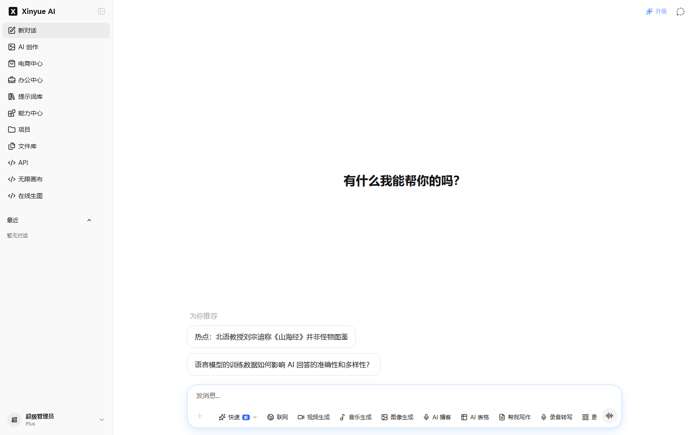

# Xinyue AI

Xinyue AI 是面向团队和商业运营的 AI 工作平台，包含用户工作区、企业管理后台和统一 API 服务。



## 主要能力

- 多模型对话、流式输出、临时聊天、历史会话和附件上传
- 图片、视频与商品视觉生成，支持模型路由、失败切换和任务取消
- Agent 办公任务、联网搜索、审批中断、知识库与 Office 文件导出
- 提示词灵感库、技能市场、助手、工具授权、项目和团队协作
- 套餐、充值、兑换码、额度流水、用户分组和支付渠道
- 企业管理后台、内容审核、审计日志、运营告警和系统健康检查
- 首次安装向导、Docker Compose 部署和数据库自动迁移

## 技术架构

```text
Browser
  -> Nginx :80
     -> Vue 3 user application /
     -> Art Design Pro admin /admin/
     -> NestJS API /v1/*
        -> PostgreSQL 17
        -> Redis 7 / BullMQ
        -> persistent uploads
```

- 用户端：Vue 3、TypeScript、Vite、Pinia
- 管理端：Art Design Pro、Vue 3、Element Plus
- 服务端：NestJS、Fastify、Prisma、PostgreSQL、Redis、BullMQ、LangGraph.js

更多界面见 [演示图](docs/images/README.md)，完整生产部署见 [部署与运维指南](docs/DEPLOYMENT.md)。

## 本地开发

要求 Node.js 20.19+（推荐 22）、npm、pnpm 和 Docker Desktop。

```powershell
npm ci
npm --prefix server ci
pnpm --dir admin install --frozen-lockfile
docker compose up -d
Copy-Item server/.env.example server/.env
npm --prefix server run prisma:generate
npm --prefix server run prisma:deploy
npm --prefix server run admin:seed
```

在三个终端分别运行：

```powershell
npm run dev
npm run server:dev
npm run admin:dev
```

- 用户端：`http://localhost:5173`
- 管理端：`http://localhost:5174/admin/`
- API：`http://localhost:3100/v1`

请在启动前替换 `server/.env` 中的默认管理员密码、会话密钥和凭据加密密钥。

## 生产部署

```powershell
Copy-Item .env.production.example .env.production
docker compose --env-file .env.production -f docker-compose.prod.yml up -d --build
docker compose --env-file .env.production -f docker-compose.prod.yml logs -f backend
```

首次部署访问 `http://服务器地址/install` 完成数据库、站点和超级管理员配置。生产环境必须配置域名、HTTPS、`WEB_ORIGIN=https://你的域名` 和 `COOKIE_SECURE=true`。具体参数及升级、备份、回滚步骤见 [docs/DEPLOYMENT.md](docs/DEPLOYMENT.md)。

## 质量验证

```powershell
npm run audit:ui-actions
npm run verify
npm run test:e2e
```

`audit:ui-actions` 会扫描 Vue 页面中的按钮和链接；`verify` 会构建用户端、管理端和服务端；Playwright 覆盖登录、支付、生成、项目、文件库、知识库和主要后台页面。

## 协作和第三方软件

功能开发请使用分支和 Pull Request，约定见 [CONTRIBUTING.md](CONTRIBUTING.md)。第三方声明和保留的许可证见 [THIRD_PARTY_NOTICES.md](THIRD_PARTY_NOTICES.md)。

运行时 `.env`、日志、数据库、构建产物和用户上传文件不会提交到 Git。禁止在提交、Issue 或 Pull Request 中写入真实密钥。
